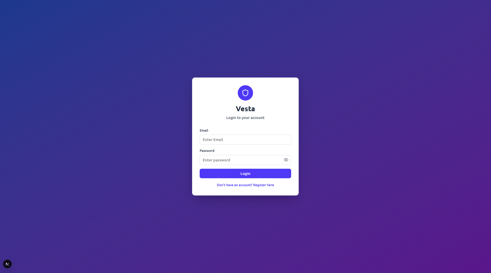

# 🏦 Banking App

A secure and user-friendly banking system that allows customers to create and manage accounts, perform transactions, and maintain financial records. Built with Next.js (frontend), Spring Boot (backend), and PostgreSQL (database).
<div align="center">
  
  
  
  
  
  
  
  
  
</div>

## 🔗 Visit The Site

Feel free to visit the site here



Here is a video that demonstrates how to navigate the app.

## 🏗️ Tech Stack

- **Frontend:** [Next.js](https://nextjs.org/) - React framework for production
- **Backend:** [Spring Boot](https://spring.io/projects/spring-boot) - Java-based backend framework
- **Database:** [PostgreSQL](https://www.postgresql.org/) - Relational database
- **Authentication:** JWT / Spring Security 
- **Deployment:** **(Put deployment here)**

## ✨ Features

### 👤 User Management
- Secure user registration and login
- Authentication with encrypted passwords
- Profile management with personal and contact details
- Session handling with timeout/auto logout

### 🧾 Account Management
- Create and manage different account types (Debit, Savings, ISA)
- View account details and current balances
- Handle account status (Open, Closed)

### 💸 Transaction System
- Internal money transfers between user accounts
- Deposit and withdrawal functionality
- Searchable and filterable transaction history
- Transaction validation and configurable limits

### 🪪 Security
- Secure login system with encrypted credentials
- JWT authentication
- Spring Security integration
- User sessions lasting 10 minutes

## 📱Mobile Phone Navigation
Here are the instructions for navigating through the app on a mobile screen:
- Click the button in the top right corner to make the sidebar appear from the left. The current page will become blurred.

- Click on the desired page from the sidebar. The blurred current page will switch to the selected page, which will also be blurred.

- Click the button in the top right corner again to close the sidebar and unblur the current page.

## 📁 Project Structure

```
banking-app/
├── client/                    # Next.js Frontend
│   ├── src/
│   ├── public/
│   ├── package.json
│   ├── next.config.js
│   ├── .env.local            # Frontend configuration
│   └── ...
├── server/                   # Spring Boot Backend
│   ├── src/
│   │   └── main/
│   │       ├── java/
│   │       └── resources/
│   │           └── application.yaml  # Backend configuration
│   ├── pom.xml
│   └── ...
├── database/                 # PostgreSQL Setup
│   ├── ...
└── README.md
```

### Frontend (Client) - Next.js
- **Location:** `/client`
- **Framework:** Next.js
- **Purpose:** User interface for banking operations
- **Configuration:** `.env.local` for environment variables
- **Features:**
  - User registration and login interface
  - Account management dashboard
  - Transaction history views
  - Profile management
  - Responsive design

### Backend (Server) - Spring Boot
- **Location:** `/server`
- **Framework:** Spring Boot (Java 17+)
- **Purpose:** API server and business logic
- **Configuration:** `application.properties` or environment variables
- **Features:**
  - RESTful API endpoints
  - User authentication and authorization
  - Account management services
  - Transaction processing
  - Security implementation

### Database - PostgreSQL
- **Location:** `/database`
- **Database:** PostgreSQL
- **Purpose:** Data persistence and management
- **Components:**
  - Database scripts for setup
  - Migration files for schema changes
  - Database name: `banking_app`

## 🚀 Getting Started

### Prerequisites

- **Next.js** 15+
- **Java:** 17+
- **PostgreSQL:** 17+
- **TypeScript** 5.8+

### Installation

1. **Clone the repository**
   ```bash
   git clone https://github.com/HakimM16/banking-app.git
   cd banking-app
   ```

2. **Database Setup**
   - Create a PostgreSQL database named `banking_app`
   - Set credentials in `/server/src/main/resources/application.properties` or use environment variables

3. **Backend Setup**
   ```bash
   cd server
   ./mvnw spring-boot:run
   ```

4. **Frontend Setup**
   ```bash
   cd client
   npm install
   npm run dev
   ```

### Configuration

- **Backend config:** `/server/src/main/resources/application.yaml`
- **Frontend config:** `/client/.env.local`

## 🔧 Environment Variables

Create a `.env.local` file in the `client` directory:

```env
NEXT_PUBLIC_API_URL=http://localhost:8080/api
```

Configure your `application.yaml` in the `server/src/main/resources/` directory:

```properties
spring:
  application:
    name: banking-backend
  datasource:
    url: jdbc:postgresql://localhost:5432/banking_app
    username: your_username
    password: your_password
  jpa:
    hibernate:
      dialect: org.hibernate.dialect.PostgreSQLDialect
    ddl:
      auto: update
  jwt:
    secret: your_api_key
    accessTokenExpiration: 600 # 10 minutes
    refreshTokenExpiration: 604800 # 7 days
  flyway:
    enabled: true
    # locations: classpath:db/migration # If necessary.
    baseline-on-migrate: true
    baseline-version: 1
management:
  endpoints:
    web:
      exposure:
        include=health:
```

## 🛠️ Development

### Backend (Spring Boot)
The backend runs on `http://localhost:8080` by default and provides REST APIs for:
- User authentication and management
- Account operations
- Transaction processing
- Security and validation

### Frontend (Next.js)
The frontend runs on `http://localhost:3000` and provides:
- Responsive user interface
- Account dashboard
- Transaction forms and history
- User profile management

## 🤝Contribution
Contributions are welcome! If you'd like to enhance this project or report issues, please submit a pull request or open an issue.

## 📞 Contact

Email - [hakimmabike@gmail.com](mailto:hakimmabike@gmail.com)

Project Link: [https://github.com/HakimM16/banking-app](https://github.com/HakimM16/banking-app)
